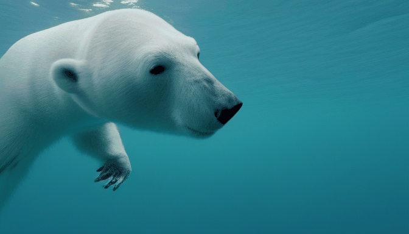

# hotshotco/Hotshot-XL Cog model

This is an implementation of the [hotshotco/Hotshot-XL](https://github.com/hotshotco/hotshot-xl) as a Cog model. [Cog packages machine learning models as standard containers.](https://github.com/replicate/cog)

Run predictions:

    cog predict -i prompt="go-pro video of a polar bear diving in the ocean, 8k, HD, dslr, nature footage" -i seed=6226

## Example:

"go-pro video of a polar bear diving in the ocean, 8k, HD, dslr, nature footage"

